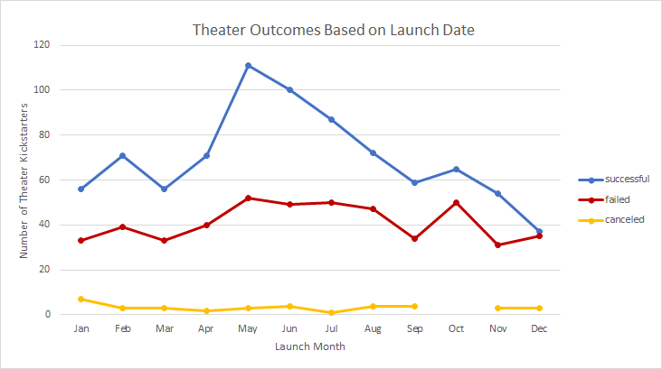
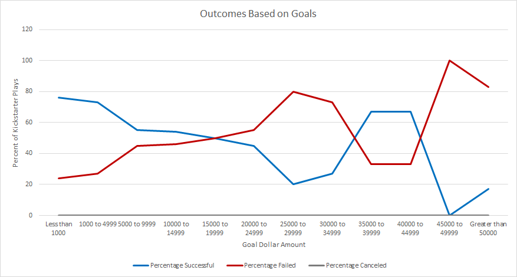

# Kickstarting with Excel

## Overview of Project

### Purpose 

To compare the launch date and funding goals of *Fever* to other kickstarter campaigns. 	

## Analysis and Challenges

Campaign's Outcomes were charted based on Launch Date and Financial Goals

### Analysis of Outcomes Based on Launch Date

### Analysis of Outcomes Based on Goals

### Challenges and Difficulties Encountered

Initial look into the data required some cleaning up and sorting.  

-Kickstarter data was filtered based on 'Parent category,' followed by the addition of a Subcategory column to allow for filtering based on specific genre  

-Unix time stamps converted into standard date format (MM/DD/YYYY). 
Formula used to convert timestamps:
> =(((Ref cell/60)/60)/24)+DATE(1970,1,1)

## Results

- What are two conclusions you can draw about the Outcomes based on Launch Date?
  1. The most amount of successful theater kickstarter campaigns launched in the month of May, suggesting that Fever's best chance of success is to launch in May.
  2. There are equal outcomes of success and failed campaigns in the month of December.

- What can you conclude about the Outcomes based on Goals?
  1. There is a negative trend towards campaign outcome with an increase in financial goal amount

- What are some limitations of this dataset?

In our analysis above, we notice that there is a negative trend with success as the financial goal of the campaigns increase, however there are still successful campaings that spend more >$50,000 (~17%). Knowning who these backers are, as well as where they live, could provide more data as to indicating successful fundraising (i.e plays are more likely backed by wealthier donors in an affluent neighborhood or country).  Furthermore, initial analysis shows that the month of May had the most successful campaign outcomes (111 successful outcomes).

These data sets are limited in capacity of showing us who the backers are that could show us the success of a campaign. 

- What are some other possible tables and/or graphs that we could create?
